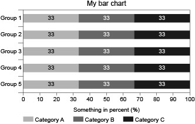
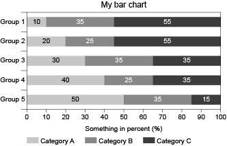

```{r, include = FALSE}
knitr::opts_chunk$set(
  collapse = TRUE,
  comment = "#>"
)

```

# Purpose
The purpose of `svgtools` is to manipulate SVG files that are templates of charts the user wants to produce. In vector graphics one copes with x-/y-coordinates of elements (e.g. lines, rectangles, text). Their scale is often dependent on the program that is used to produce the graphics. In applied statistics one usually has numeric values on a fixed scale (e.g. percentage values between 0 and 100) to show in a chart. Basically, `svgtools` transforms the statistical values into coordinates and widths/heights of the vector graphics.

SVG file format is nothing else than XML (see [here](https://www.w3schools.com/graphics/svg_intro.asp)). By the means of package `xml2`, `svgtools` reads SVG files and then changes certain attributes or even whole elements in the XML document.

For example, an SVG image might look like this:



Its file content contains lines in XML:
```
...
<g id="myBars">
	<g>
		<rect x="141.732" y="92.126" fill="#C6C6C6" width="94.394" height="14.173"/>
		<rect x="236.126" y="92.126" fill="#878787" width="94.394" height="14.173"/>
		<rect x="330.52" y="92.126" fill="#3C3C3B" width="94.677" height="14.173"/>
		<text transform="matrix(1 0 0 1 183.396 101.8799)" font-family="'ArialMT'" font-size="10">33</text>
		<text transform="matrix(1 0 0 1 277.7612 101.8799)" fill="#FFFFFF" font-family="'ArialMT'" font-size="10">33</text>
		<text transform="matrix(1 0 0 1 372.1265 101.8799)" fill="#FFFFFF" font-family="'ArialMT'" font-size="10">33</text>
	</g>
	...
</g>
<rect id="myFrame" x="141.732" y="85.04" fill="none" stroke="#000000" stroke-width="0.5" stroke-miterlimit="10" width="283.464" height="141.732"/>
...
```
What we see here are three rectangle elements (top bar of the chart) with graphical x-coordinates and widths that lie within a rather arbitrary range. The same holds for three text elements (value labels of top bar) and their coordinates that are stored within a SVG transformation matrix in attribute 'transform'. Their text entry is fixed to 33. All of these are grouped together (top bar with value labels) and then grouped again (all the bars). The last line shown corresponds to the rectangle that serves as the outer frame of the data area of the chart.

The following lines of code are enough to set coordinats, widths and numbers in the bar chart right when, for example, percentage values are stored within a dataframe of 5 rows (the groups) and 3 columns (the categories):
```
svg <- read_svg(file = "images/fig1.svg")
myValues <- data.frame(cat1=c(0.1,0.2,0.3,0.4,0.5),
                       cat2=c(0.35,0.25,0.35,0.25,0.35),
                       cat3=c(0.55,0.55,0.35,0.35,0.15))
svg <- stackedBar(svg = svg,frame_name = "myFrame",group_name = "myBars",
                  scale_real = c(0,100),values = myValues*100)
write_svg(svg = svg,file = "images/fig1_values.svg")
```
The result looks like this:



The magic happens at the function call for `stackedBar`. Here, one argument refers to the named rectangle 'myFrame' to define outer limits for the graphical coordinates and one argument to the named group of elements 'myBars' containing rectangles (bar segments) and texts (value labels) for the chart. Concerning the values one wants to show in the chart, the "real" scale is defined by a vector ranging from 0 to 100 and a dataframe with values is provided. `svgtools` can now calculate the corresponding graphical coordinates and widths and change the elements in 'myBars' accordingly.

This vignette explains how to set up SVG files so that `svgtools` can work with them and gives insight in the most common usage of package functions. For detailed information on all functions and arguments see `?stackedBar` and others.

# Reading, displaying and writing SVG files
Functions for file handling and display are rather straight-forward in `svgtools`. A typical workflow looks like that:
```
svg <- read_svg(file = "myFile.svg")
summary_svg(svg = svg)
display_svg(svg = svg)
# Code to manipulate the SVG
# ...
display_svg(svg = svg)
write_svg(svg = svg,file = "myFile_out.svg")
```
`read_svg` relies on `read_xml` from the `xml2` package. So it has all the possibilities to read a file from the file system, a connection or even a raw vector. It defaults to encoding UTF-8, which may be changed with argument `enc="latin-1"`, for example.

Function `summary_svg` is a convenience function that prints some useful information about the SVG content on the console (or whereever `sink` is set to). For the SVG in Fig. 1 the output would look like this:
```
[1] "************************"
[1] "** -- SVG SUMMARY: -- **"
[1] "************************"
[1] "-- NAMED GROUPS:"
[1] "myBars with 5 children"
[1] "-- AVAILABLE FRAMES:"
[1] "myFrame"
[1] "-- USED FONTS:"
[1] "'ArialMT'"
[1] "-- USED FONT SIZES:"
[1] "10"
[1] "-- USED COLORS:"
[1] "#C6C6C6" "#878787" "#3C3C3B" "none"    "#000000"
```
One can see that there is a named group ('myBars') in the SVG. It contains five child elements, that are the five bars of the chart, see further below. Also, there is one "available frame" (a named rectangle) called 'myFrame'. This information helps with setting right the arguments in the function calls to manipulate the SVG. Further information on used fonts, font sizes and colors in the SVG only serves the purpose of validating the consistency of the design. One can invoke `summary_svg` directly by argument `summary=TRUE` of `read_svg`.

To display an SVG on the current viewport one may use `display_svg`. Standard viewport depends on operating system and IDE. For example, RStudio plots the image under the Viewer tab. By default, width and height of the bitmap (image) are derived from its content and the current DPI setting of the viewport. But one can set desired width and height with the correspondent function arguments.

Typically, `display_svg` is used before and after SVG manipulation to get visual proof of the changes. Therefore, argument `display=TRUE` of `read_svg` conveniently invokes the function.

Finally, `write_svg` uses `write_xml` from the `xml2` package to write the (then manipulated) SVG to file system or an open connection. By default, hidden elements of the SVG are removed in the written file (not in the XML document in the R environment). To change this behavior set `remove_hidden=FALSE`. If one wants to remove all groupings in the written file (again, not in the XML document itself) it is possible to set `flatten=TRUE`. This may be beneficial in further layouting tasks on the resulting SVG image.

# General principles of operation
`svgtools` relies heavily on naming objects of the SVG. One can always accomplish that with any text editor by inserting id-attributes in the XML element for the object. See the following:
```
<rect id="myFrame" x="141.732" y="85.04" width="283.464" height="141.732"/>
```
Naming an object in that way is also possible in almost any vector graphics program. (Check the manuals.) For example, in Adobe Illustrator using the Layers Panel to name objects ultimately leads to XML elements with id-tags when saving as SVG.

The following rules apply:

* Elements (frame, groups) have to be named without spaces or any irregular characters (like _-,;!?).
* There must not be duplicate names. Adobe Illustrator actively prevents that by adding numbers to a name that would be a duplicate otherwise. Be mindful of that behavior and check `summary_svg`!
* Only specific elements need to be named. Further naming does not hinder execution as long as it doesn't violate the rule right above. Still, knowing which elements need to have names keeps the SVG tidy, so the following sections provide insight on that.

On the side of the values one wants to show in a chart, be mindful that `svgtools` does not calculate anything apart from the right coordinates and widths/heights of objects. This is relevant in situations like the following:

* If one wants to get a bar chart that stacks up to 100 percent, the vector(s) of numerical values should sum up to 1 (with scale 0-1) or 100 (with scale 0-100). Providing, in contrast, absolute frequencies (in combination with the scales mentioned) would lead to unexpected behavior like overfloating bars.
* If one wants value labels to show percentages as integer numbers, one needs to provide them in the numeric range of 0-100 or multiply relative frequencies accordingly when setting the `values` argument at function calls.
* As an exception, function `percentileBar` takes percentile values and recalculates them into differences between percentiles to provide widths for bar segments.

Adjustment of charts with lines and/or symbols needs a simple vector of numerical values. For bar charts, it is possible to adjust several bars at once. In that case, one needs to provide a dataframe or a matrix (with only numerical values). Then, rows always concern different bars, while columns define the sequence of bar segments to stack.

Horizontal and vertical alignment of charts works essentially the same. A corresponding argument is provided in all manipulating functions except `changeText`. Mind that `alignment="horizontal"` means adjusting x-coordinates for all chart types while `alignment="vertical"` always refers to adjustment of y-coordinates. This may be counter-intuitive when it comes to line charts, see below.

# Adjusting bar charts

```
svg <- read_svg(file = "images/fig3.svg",summary = TRUE,display = TRUE)
```

```
...
<g id="overall">
	<rect x="156.746" y="255.119" fill="#3C3C3B" width="26.667" height="56.693"/>
	<rect x="156.746" y="198.425" fill="#878787" width="26.667" height="56.693"/>
	<rect x="156.746" y="141.732" fill="#C6C6C6" width="26.667" height="56.693"/>
	<text transform="matrix(1 0 0 1 164.5171 306.2188)" fill="#FFFFFF" font-family="'ArialMT'" font-size="10">20</text>
	<text transform="matrix(1 0 0 1 164.5171 249.5259)" fill="#FFFFFF" font-family="'ArialMT'" font-size="10">20</text>
	<text transform="matrix(1 0 0 1 164.5171 192.833)" font-family="'ArialMT'" font-size="10">20</text>
</g>
```

```
<g id="subgroups">
	<g>
		<rect x="213.438" y="255.119" fill="#3C3C3B" width="26.667" height="56.693"/>
		<rect x="213.438" y="198.425" fill="#878787" width="26.667" height="56.693"/>
		<rect x="213.438" y="141.732" fill="#C6C6C6" width="26.667" height="56.693"/>
		<text transform="matrix(1 0 0 1 221.21 306.2188)" fill="#FFFFFF" font-family="'ArialMT'" font-size="10">20</text>
		<text transform="matrix(1 0 0 1 221.21 249.5259)" fill="#FFFFFF" font-family="'ArialMT'" font-size="10">20</text>
		<text transform="matrix(1 0 0 1 221.21 192.833)" font-family="'ArialMT'" font-size="10">20</text>
	</g>
	<g>
		...
	</g>
	<g>
		...
	</g>
</g>
...
```

```
svg <- stackedBar(svg = svg,frame_name = "frame",group_name = "overall",scale_real = c(0,160),values = c(9.97,42.42,105.71),alignment = "vertical",has_labels = TRUE,label_position = "end",decimals = 0,display_limits = 10)
display_svg(svg = svg)

```


# Adjusting line and/or symbol charts


# Adjusting scatter plots


# Changing text in text elements
No special requirements are needed to change text in text elements. The text element can either be named (id-tag in XML) or contain a text to identify it.

Use `changeText()` to manipulate

One thing to be aware of is the 

```{r setup}
library(svgtools)
```
